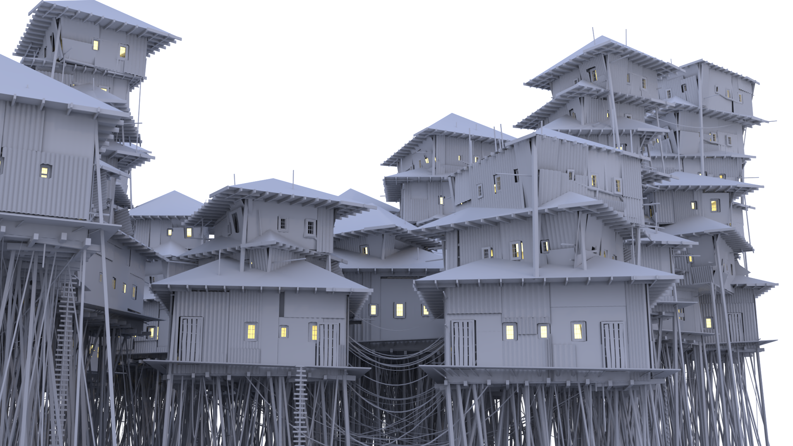
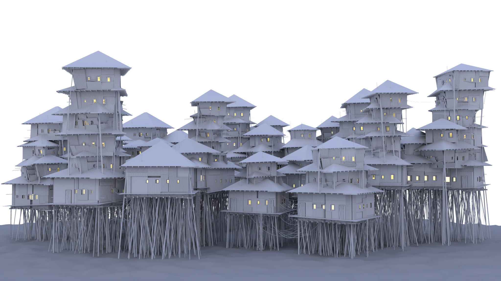
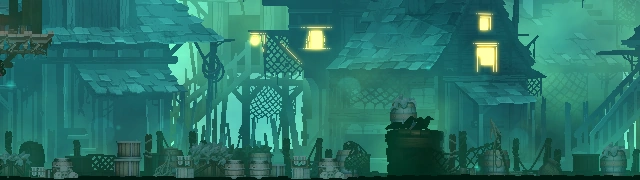

# CIS 5660 HW03 Procedural Buildings : Lewis Ghrist

# Images

Demo vid: [Vid](https://youtu.be/p0PV_0bE47U)

# Reference Images / Inspiration

Generated with Midjourney 

Dead Cells

# Breakdown
Overall I wanted a slightly different type of generator than what the tutorial was going for. Rather than having a tool the lets you completely customize each part of a single building, I wanted a system that allowed for a more scallable tool for larger scale scattering. This lead me to have my tool take in a base grid which the house would be generated on. Additionally, my sytem is more random based with parameters to limit and control that random valus. This makes getting a large variety of completely unique building much easier. The images above were made by simply feeding in a series of planes from a voronoi fracture and changing the master seed for each prim. 

## Base Structure
The base scattering of the box was done a bit differently from the intructed tutorial. Since the look I was going for was more chaotic than just base blocks stacked ontop of eachother, I had my inital blocks be placed randomly above an inputted plane. This allowed for both position and orientation of the blocks to randomized while also also allowing me to specify the number of bases I wanted. To generate the upper blocks, I scattered a point ontop of each block and randomized that point's normal and pscale to get a random orientation and size of the next floor I copy onto that point. These base blocks were then split up into a few different systems for the details and rooves. 

## Wall Details
To get the corigated mattel panneling on the sides I started by dividing each side with a Lbas Lot Subdivision node. For each resulting prim, a series of lines was coppied to its surface with every other line beight slightly offset. These lines were then connected to for the mesh. Some optimization with point grouping and blasting was used to avoid using a boolean to cut holes for the windows and doors. An undelying structure of poly wired lines was added to give another level of detail in the places where the mettel pannels have gaps. 

